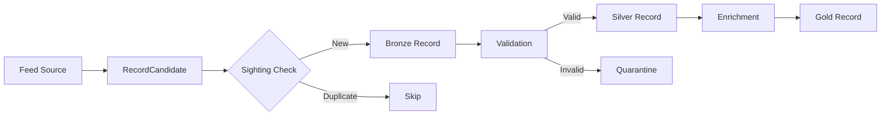

# Architecture Overview

FeedSpine is designed around **protocols** and **composability**. Every major
component can be swapped out without changing the rest of the system.

## Design Principles

### 1. Protocol-Based Design

Instead of inheritance hierarchies, FeedSpine uses Python's `Protocol` type for
defining interfaces:

```python
from typing import Protocol

class StorageBackend(Protocol):
    """Any class with these methods works."""
    
    async def store(self, record: Record) -> None: ...
    async def get(self, record_id: str) -> Record | None: ...
```

**Benefits:**
- Structural subtyping (duck typing with type safety)
- No framework lock-in
- Easy testing with mock implementations

### 2. Async-First

All I/O operations are async:

```python
# Everything is awaitable
await storage.store(record)
await cache.get(key)
await queue.enqueue(task)
```

**Why:**
- Modern Python async is mature and fast
- Natural fit for I/O-bound feed processing
- Enables high concurrency without threads

### 3. Medallion Architecture

Data flows through quality tiers:

```
Feed Data → Bronze (raw) → Silver (clean) → Gold (enriched)
```

This pattern from data engineering ensures:
- Raw data is never lost
- Processing is idempotent
- Quality improves incrementally

### 4. Typed Content Schemas

Record content can be accessed with full type safety using `ContentSchema`:

```python
from feedspine import ContentSchema, TypedRecord

class ArticleContent(ContentSchema):
    title: str
    author: str
    body: str
    word_count: int = 0

# Type-safe access
typed = TypedRecord(record, ArticleContent)
print(typed.content.title)  # IDE autocomplete works!
```

**Benefits:**
- IDE autocomplete and type checking
- Validation on load
- Domain-specific content models

### 5. Domain Model Conversion

Convert FeedSpine Records to domain models with the converter registry:

```python
from feedspine import RecordConverter, converter_registry

class FilingConverter(RecordConverter[Filing]):
    domain = "sec"
    
    def convert(self, record: Record) -> Filing:
        return Filing(
            accession_number=record.natural_key,
            form_type=record.content["form_type"],
            # ...
        )

converter_registry.register(FilingConverter())

# Convert anywhere in your code
filing = converter_registry.convert("sec", record)
```

## Component Architecture

```
┌─────────────────────────────────────────────────────────────┐
│                        FeedSpine                            │
├─────────────────────────────────────────────────────────────┤
│                                                             │
│  ┌─────────────┐    ┌─────────────┐    ┌─────────────┐    │
│  │    Feed     │ →  │   Record    │ →  │   Storage   │    │
│  │  (source)   │    │  Candidate  │    │  (backend)  │    │
│  └─────────────┘    └─────────────┘    └─────────────┘    │
│         │                  │                  │            │
│         ↓                  ↓                  ↓            │
│  ┌─────────────┐    ┌─────────────┐    ┌─────────────┐    │
│  │   Parser    │    │   Record    │    │    Cache    │    │
│  │             │    │  (layered)  │    │  (backend)  │    │
│  └─────────────┘    └─────────────┘    └─────────────┘    │
│                            │                              │
│                            ↓                              │
│                     ┌─────────────┐                       │
│                     │   Search    │                       │
│                     │  (backend)  │                       │
│                     └─────────────┘                       │
│                                                             │
└─────────────────────────────────────────────────────────────┘
```

## Protocol Overview

| Protocol | Purpose | Example Implementations |
|----------|---------|------------------------|
| `StorageBackend` | Persist records | MemoryStorage, PostgresStorage |
| `CacheBackend` | Fast key-value | MemoryCache, RedisCache |
| `SearchBackend` | Full-text search | ElasticsearchSearch |
| `BlobBackend` | Large file storage | S3Blob, LocalBlob |
| `QueueBackend` | Task distribution | RabbitMQQueue, RedisQueue |
| `ExecutorBackend` | Task execution | LocalExecutor, CeleryExecutor |
| `NotificationBackend` | Alerts | SlackNotification, EmailNotification |
| `Enricher` | Single record enrichment | MetadataEnricher, PassthroughEnricher |
| `BatchEnricher` | Batch record enrichment | Custom batch enrichers |

## Query Builder

Build type-safe queries with the fluent `Query` API:

```python
from feedspine import Query, Layer

query = (Query()
    .layer(Layer.SILVER)
    .where("form_type", "10-K")
    .published_after(datetime(2024, 1, 1))
    .order_by("published_at", descending=True)
    .limit(50))

# Use with storage
async for record in storage.query(**query.build()):
    process(record)
```

## Resource Management

Use `ResourcePool` for shared resources like HTTP clients and rate limiters:

```python
from feedspine import ResourcePool, RateLimiter

pool = ResourcePool()
await pool.initialize()

# Register shared resources
pool.register_factory("http_client", create_http_client)
pool.set("rate_limiter", RateLimiter(rate=10, burst=10))

# Use anywhere
client = await pool.get_async("http_client")
limiter = pool.get("rate_limiter")
await limiter.acquire()
```

## Checkpoint Support

Resume long-running collections with built-in checkpointing:

```python
from feedspine import CheckpointManager, FileCheckpointStore

store = FileCheckpointStore(Path("./checkpoints"))
manager = CheckpointManager(store, save_interval=100)

# Start or resume collection
if checkpoint := await manager.resume("sec-daily-2024"):
    print(f"Resuming from record {checkpoint.records_processed}")
else:
    manager.start("sec-daily-2024", "sec-daily")

# Update during collection
manager.update(records_processed=count, position={"page": page})
await manager.maybe_save()  # Saves if interval reached

# Complete when done
await manager.complete()
```

## Data Flow



## See Also

- [The Layer System](layers.md) - Deep dive into Bronze/Silver/Gold
- [Protocol Design](protocols.md) - How protocols enable flexibility
- [API Reference](../reference/) - Complete interface documentation

